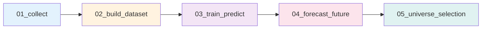

# 📄 Data Schema Definition (v3.3.0)

본 스키마는 SignalWeaver 프로젝트의 데이터 계약을 정의합니다.

---

## 📌 Schema Version & Metadata

| 속성 | 값 |
|------|-----|
| **Schema Version** | `3.3.0` |
| **Last Updated** | 2026-02-09 |
| **Latest Changes** | H1(폴더구조) + H2(경로중앙화) + H3(모듈정리) |
| **Compatibility** | v3.2.x 부분 호환 (폴더 마이그레이션 필요) |

---

## 🔄 최근 변경 이력 요약

### v3.3.0 (2026-02-09) - 🟢 MINOR
- **H1 (폴더 구조 개선)**: `data/03_results/` 분해 → `03_training/`, `04_forecasts/`, `05_universe/` 독립
- **H2 (경로 중앙화)**: `ProjectPaths` 클래스 도입 → 모든 노트북 경로 관리 통일
- **H3 (모듈 정리)**: `src/universe/select_universe.py` Facade Pattern 적용
- **하위 호환**: 부분 (폴더 마이그레이션 필요, 파일 포맷 변경 없음)

### v3.2.1 (2026-02-09) - 🔵 PATCH
- **Critical**: Multi-Horizon Walk-Forward 데이터 누수 버그 수정
- **Critical**: Recursive Extension Chunk 오염 방지

### v3.2.0 (2026-02-07) - 🟢 MINOR
- **04단계 추가**: Recursive Extension을 이용한 미래 주가 예측
- **05단계 추가**: 3대 평가 지표(정확도/수익성/리스크) 기반 유니버스 선정
- **새로운 데이터 구조**: 예측 결과, 위험 지표, 종합 점수 등

---

## 📌 파일 저장 규칙 / 포맷 (Updated v3.3.0)

### 1.1 기본 포맷

| 단계 | 폴더 | 포맷 | 이유 |
|------|------|------|------|
| **01단계 (Raw)** | `data/01_raw/{date}/` | CSV + 통합 Parquet | API 원본 보존 + 파이프라인 효율성 |
| **02단계 (Processed)** | `data/02_processed/{date}/` | Parquet + 선택적 CSV | 고속 I/O + 디버깅 지원 |
| **03단계 (Training)** | `data/03_training/{date}/` | 🆕 Parquet + 개별 CSV | 학습 검증 예측 (과거 데이터) |
| **04단계 (Forecasts)** | `data/04_forecasts/{date}/` | 🆕 Parquet + 선택적 CSV | 미래 예측값 저장 |
| **05단계 (Universe)** | `data/05_universe/{date}/` | 🆕 Parquet + CSV + JSON | 투자 후보 선정 결과 |

### 1.2 파일 네이밍 규칙 (v3.3.0)

```
# 01단계: 원시 데이터
data/01_raw/{YYYYMMDD}/
  ├── krx_prices_{YYYYMMDD}.parquet    # 통합 원시 데이터
  ├── ticker_master_{YYYYMMDD}.csv     # 종목 메타
  └── csv/{종목명}.csv                  # 개별 CSV (옵션)

# 02단계: 전처리 데이터
data/02_processed/{YYYYMMDD}/
  ├── dataset.parquet                   # 통합 Feature 데이터셋
  └── csv/{종목명}.csv                  # 개별 CSV (옵션)

# 03단계: 학습 검증 예측 (H1 변경: 03_results → 03_training)
data/03_training/{YYYYMMDD}/
  ├── *.pkl                             # 모델 아티팩트
  ├── registry.json                     # 모델 registry
  ├── predictions.parquet               # 과거 예측 결과
  └── csv/{종목명}.csv                  # 개별 CSV (옵션)

# 04단계: 미래 예측 (H1 변경: results/forecasts → 04_forecasts)
data/04_forecasts/{YYYYMMDD}/
  ├── future_forecasts.parquet          # 통합 미래 예측값
  └── csv/{종목명}_forecast.csv         # 개별 CSV (옵션)

# 05단계: 유니버스 선정 (H1 변경: results/universe → 05_universe)
data/05_universe/{YYYYMMDD}/
  ├── universe_full.parquet             # 전체 평가 완료 종목
  ├── universe_candidates.parquet       # Top-K 후보
  ├── investment_report.csv             # 상세 리포트 (CSV)
  ├── investment_report.xlsx            # Excel 리포트 (선택)
  └── filter_statistics.json            # 필터링 통계

# 메타 데이터
data/99_meta/
  └── krx_calendar.csv                  # 영업일 캘린더
```

---

## 📌 2. 공통 기본 컬럼

모든 단계에서 공통으로 사용되는 필수 컬럼입니다.

| 컬럼명 | 타입 | 설명 | 필수 여부 |
|--------|------|------|-----------|
| `date` | date | 거래일 (YYYY-MM-DD) | ✅ |
| `ticker` | string | 종목 코드 (6자리) | ✅ |
| `open` | float | 시가 | ✅ |
| `high` | float | 고가 | ✅ |
| `low` | float | 저가 | ✅ |
| `close` | float | 종가 | ✅ |
| `volume` | int64 | 거래량 | ✅ |

---

## 📌 3. Feature 스키마 (feature_ prefix)

### 3.1 가격 기반 기본 지표

| 컬럼명 | 설명 |
|--------|------|
| `feature_ma_5` | 5일 단순 이동평균 |
| `feature_ma_20` | 20일 단순 이동평균 |
| `feature_ma_60` | 60일 단순 이동평균 |
| `feature_volatility_20` | 20일 수익률 표준편차 |

### 3.2 기술적 지표 (Technical Indicators)

| 컬럼명 | 설명 |
|--------|------|
| `feature_rsi_14` | RSI (Relative Strength Index) |
| `feature_macd` | MACD 값 |
| `feature_macd_signal` | MACD 시그널 |
| `feature_macd_hist` | MACD 히스토그램 |
| `feature_bb_upper` | 볼린저 상단 |
| `feature_bb_middle` | 볼린저 중심선 |
| `feature_bb_lower` | 볼린저 하단 |
| `feature_volume_ratio` | 거래량 비율 |

---

## 📌 4. Universe Meta (운영 판단용 지표)

02단계에서 생성되며, **학습 Feature 및 운영 필터링**에 활용됩니다.

| 컬럼명 | 타입 | 설명 |
|--------|------|------|
| `liquidity_score` | float | 유동성 점수 (20일 평균 거래대금) |
| `risk_composite` | float | 복합 리스크 점수 (0~1) |
| `is_suspended` | int | 거래정지 여부 (0: 정상, 1: 정지) |
| `is_delisted` | int | 상장폐지 여부 (0: 정상, 1: 폐지) |

---

## 📌 5. Target (타겟) 스키마

### 5.1 Target 정의 (v3.1.1 규칙 유지)

```python
# 02단계에서 생성
df['target_log_close'] = np.log(df['close'])
```

### 5.2 Target 컬럼

| 컬럼명 | 타입 | 설명 | 생성 위치 |
|--------|------|------|-----------|
| `target_log_close` | float | 로그 종가 (기준 타깃) | **02단계** |

---

## 📌 6. Multi-Horizon 예측 구조 (v3.1.0 규칙 유지)

### 6.1 개념

기존의 단일 시점 예측 대신, **한 번의 학습으로 5일치(1주일) 가격을 동시에 예측**합니다.

```
입력 (t-5일 피처) → 모델 → 출력 (t일 가격 예측)
입력 (t-4일 피처) → 모델 → 출력 (t일 가격 예측)
...
입력 (t-1일 피처) → 모델 → 출력 (t일 가격 예측)
```

### 6.2 Horizon 정의

| Horizon | 의미 | 학습 시 Feature 시점 |
|---------|------|---------------------|
| h=1 | 1일 앞 예측 | t-1일 |
| h=2 | 2일 앞 예측 | t-2일 |
| h=3 | 3일 앞 예측 | t-3일 |
| h=4 | 4일 앞 예측 | t-4일 |
| h=5 | 5일 앞 예측 | t-5일 |

---

## 📌 7. 모델 예측 결과 스키마 (03단계 - Training)

### 7.1 Multi-Horizon 예측 출력

| 컬럼명 | 설명 |
|--------|------|
| `date` | 예측 대상 날짜 (타깃 시점) |
| `ticker` | 종목 코드 |
| `close` | 실제 종가 (원화) |
| `target_log_close` | 실제 로그 종가 (공통 정답) |
| `pred_target_log_close_h1` | h=1 예측값 (로그) |
| `pred_target_log_close_h2` | h=2 예측값 (로그) |
| ... | ... |
| `pred_target_log_close_h5` | h=5 예측값 (로그) |
| `true_target_log_close_h1` | h=1 정답값 (참조용) |

**저장 위치** (v3.3.0):
- 통합: `data/03_training/{ref_date}/predictions.parquet`
- 개별: `data/03_training/{ref_date}/csv/{종목명}.csv`

---

## 📌 8. 미래 예측 결과 스키마 (04단계 - Forecasts)

### 8.1 Recursive Extension 출력

| 컬럼명 | 타입 | 설명 |
|--------|------|------|
| `date` | date | 예측 대상 날짜 |
| `ticker` | string | 종목 코드 |
| `horizon` | int | 예측 시차 (1~5) |
| `chunk_idx` | int | Recursive 단계 (0, 1, 2, ...) |
| `pred_log_close` | float | 예측 로그 종가 |
| `pred_close` | float | 예측 종가 (원화) |

### 8.2 Chunk 기반 구조

```
Chunk 0: 예측 0~4일 (t-1 ~ t-5 Feature 사용)
Chunk 1: 예측 5~9일 (Chunk 0 예측값을 Feature처럼 사용)
Chunk 2: 예측 10~14일 (Chunk 1 예측값 기반)
...
```

**저장 위치** (v3.3.0):
- 통합: `data/04_forecasts/{ref_date}/future_forecasts.parquet`
- 개별: `data/04_forecasts/{ref_date}/csv/{종목명}_forecast.csv` (선택)

### 8.3 Recursive Extension의 오차 누적

⚠️ **주의**: 뒤로 갈수록 오차 증가
- Chunk 0: 낮은 오차 (실제 Feature 기반)
- Chunk 1: 중간 오차 (Chunk 0 예측값 기반)
- Chunk 2+: 높은 오차 (예측값 체인)

**권장사항**:
- 거래: Chunk 0~1만 신뢰 (최대 10일)
- 분석: Chunk 2+ 참고용 (확률 낮음)

**🆕 v3.2.1**: Chunk 오염 방지 (volume 평균값 사용)

---

## 📌 9. 유니버스 선정 결과 스키마 (05단계 - Universe)

### 9.1 평가 지표 (3대 축)

#### A. 정확도 (Accuracy, 과거 기반)

| 컬럼명 | 설명 |
|--------|------|
| `rmse` | 과거 예측의 오차(RMSE) |
| `mae` | 평균 절대 오차 |
| `directional_accuracy` | 상승/하락 방향 적중률 (0~1) |
| `confidence_rmse` | RMSE 역수 기반 신뢰도 (높을수록 정확) |
| `accuracy_rank` | 정확도 순위 (낮을수록 정확) |

#### B. 수익성 (Return, 미래 기반)

| 컬럼명 | 설명 |
|--------|------|
| `daily_log_return` | 시간당 로그 수익률 (복리 기반) |
| `total_log_return` | 총 로그 수익률 |
| `total_return_pct` | 총 수익률 (%) |
| `hold_days` | 최적 보유 기간 (일) |
| `buy_date` | 최적 매수일 |
| `sell_date` | 최적 매도일 |
| `buy_price` | 예상 매수가 |
| `sell_price` | 예상 매도가 |
| `return_rank` | 수익률 순위 (낮을수록 높은 수익 기대) |

#### C. 위험도 (Risk, 미래 기반)

| 컬럼명 | 설명 |
|--------|------|
| `volatility` | 변동성 (로그 수익률 표준편차) |
| `downside_risk` | 하방 위험 (음수 수익률만) |
| `var_95` | VaR (5% 분위수) |
| `cvar_95` | CVaR (최악 5% 평균) |
| `max_drawdown` | 최대 낙폭 |
| `skewness` | 비대칭도 (음수면 하락 쏠림) |
| `kurtosis` | 초과 첨도 (Fat Tail 지표) |
| `risk_composite_raw` | 복합 리스크 점수 (원점수) |
| `risk_score_normalized` | 정규화 리스크 점수 (0~1) |
| `risk_rank` | 위험 순위 (낮을수록 안전) |

### 9.2 메타 정보

| 컬럼명 | 설명 |
|--------|------|
| `ticker` | 종목 코드 |
| `liquidity_score` | 유동성 점수 |
| `is_suspended` | 거래정지 여부 |
| `is_delisted` | 상장폐지 여부 |

### 9.3 필터링 단계

#### Hard Constraints (필수 조건)

| 필터 | 제거 대상 | 기준 |
|------|-----------|------|
| 거래정지/상폐 | `is_suspended=1`, `is_delisted=1` | 매매 불가능 |
| 저유동성 | 평균 거래대금 < 5천만 원 | 체결 불가 위험 |
| 고위험 | `risk_composite_raw` > 0.8 | 손실 위험 높음 |
| 저정확도 | `accuracy_rank` > 1000 | 예측 신뢰도 낮음 |

#### Soft Ranking (점수 기반)

- Strategy A 또는 B로 점수화
- 상위 Top-K 선정

---

## 📌 10. 단계별 데이터 흐름 (v3.3.0 폴더 구조 포함)

### 10.1 전체 파이프라인 (Updated)



### 10.2 단계별 책임 분리 (Updated)

| 단계 | 입력 | 처리 | 출력 | 폴더 (v3.3.0) | Target 생성 |
|------|------|------|------|-------------|-------------|
| **01** | - | API 수집 | Raw OHLCV | `01_raw` | ❌ |
| **02** | Raw OHLCV | Feature 계산 + **Target 생성** | Feature + Meta + Target | `02_processed` | ✅ |
| **03** | Feature + Target | Multi-horizon 학습 + 예측 | 모델 + 예측 | `03_training` | ❌ |
| **04** | 모델 + Feature | Recursive Extension | 미래 5~60일 예측 | `04_forecasts` | ❌ |
| **05** | 예측값 + 메타 | 평가 + 필터링 + 점수화 | 투자 후보 + 지표 | `05_universe` | ❌ |

### 10.3 데이터 변환 과정 (Updated)

```
[01단계]
ticker, date, open, high, low, close, volume

[02단계]
+ feature_ma_5, feature_rsi_14, ...
+ liquidity_score, risk_composite, ...
+ target_log_close

[03단계]
각 Horizon별로:
  - Feature를 h일 과거로 Shift
  - Multi-horizon 학습
  
결과: pred_target_log_close_h1~h5
📁 저장: data/03_training/{date}/

[04단계] 
Recursive Extension 반복:
  - Chunk 0: t-1~t-5 Feature → t+0~t+4 예측
  - Chunk 1: Chunk0 + Feature → t+5~t+9 예측
  - ...
  
결과: future_forecasts (t+1 ~ t+60)
📁 저장: data/04_forecasts/{date}/

[05단계] 
3대 평가 지표 계산:
  - 정확도: 과거 예측 오차 (model_train_date 기준)
  - 수익성: 예측 수익률 (forecast_date 기준)
  - 위험: 예측값 변동성 (내재 리스크)
  
결과: universe_full + candidates
📁 저장: data/05_universe/{date}/
```

---

## 📌 11. H2 패치: ProjectPaths 클래스 (v3.3.0)

### 11.1 사용 방식

```python
# Before (모든 노트북에서 수동 조립)
raw_dir = Path("data/01_raw") / ref_date
result_dir = Path("data/03_results") / ref_date / "predictions"

# After (통일된 인터페이스)
from src.utils.config import load_config, ProjectPaths

cfg = load_config()
paths = ProjectPaths.from_config(cfg)

# 각 단계의 경로는 메서드로 통일
raw_parquet = paths.get_raw_parquet()
dataset = paths.get_dataset_parquet()
predictions = paths.get_predictions_parquet()  # 03_training
forecasts = paths.get_forecasts_parquet()      # 04_forecasts
universe = paths.get_universe_candidates()     # 05_universe
```

### 11.2 ProjectPaths 제공 메서드

| 메서드 | 반환값 | 설명 |
|--------|--------|------|
| `get_raw_parquet()` | Path | 01단계 통합 Parquet |
| `get_dataset_parquet()` | Path | 02단계 Feature 데이터셋 |
| `get_predictions_parquet()` | Path | 03단계 예측 결과 |
| `get_forecasts_parquet()` | Path | 04단계 미래 예측 |
| `get_universe_candidates()` | Path | 05단계 Top-K 후보 |
| `ensure_dirs()` | None | 모든 출력 폴더 자동 생성 |

---

## 📌 12. 핵심 개념: 이중 날짜 기준 (05단계)

### 12.1 정확도 평가 날짜

```
model_train_date: 2026-01-20 (학습 기준일)
  ↓
  [정확도 평가]
  - 이전 예측값: 실제값과 비교 가능 (과거 데이터)
  - 지표: RMSE, MAE, 방향성 정확도
```

### 12.2 수익성 평가 날짜

```
forecast_date: 2026-02-07 (투자 결정 시점)
  ↓
  [수익성 평가]
  - 미래 예측값: 정답 없음 (예측값만 존재)
  - 지표: 예상 수익률, 최적 매매 시점
```

**중요**: 두 날짜는 다르며, 각각 다른 데이터 세트 사용

---

## 📌 13. 스키마 버전 관리 정책

### Semantic Versioning

```
schema_version: "MAJOR.MINOR.PATCH"

예: "3.3.0"
    │  │  └─ PATCH: 버그 수정 (3.2.1)
    │  └──── MINOR: 구조 개선 (3.3.0 - H1+H2+H3)
    └─────── MAJOR: 근본 구조 변경 (v2→v3)
```

### 버전별 변경 이력

| Version | Date | Type | 주요 변경 사항 |
|---------|------|------|----------------|
| **3.3.0** | 2026-02-09 | 🟢 MINOR | 폴더 구조 개선 + 경로 중앙화 + 모듈 정리 |
| **3.2.1** | 2026-02-09 | 🔵 PATCH | Multi-Horizon 버그 + Chunk 오염 방지 |
| **3.2.0** | 2026-02-07 | 🟢 MINOR | 04단계(미래예측) + 05단계(유니버스) |
| **3.1.1** | 2026-01-21 | 🔵 PATCH | Target 생성 위치 재변경 (03→02) |
| **3.1.0** | 2026-01-21 | 🟢 MINOR | Multi-horizon 예측, Target-Centric |
| 3.0.0 | 2026-01-18 | 🔴 MAJOR | Target 위치 변경, Feature Shift |
| 2.0.0 | 2024-12-28 | 🔴 MAJOR | Feature prefix 통일 |
| 1.0.0 | 2024-12-01 | - | Initial release |

---

## 📌 14. 마이그레이션 가이드

### v3.2.x → v3.3.0 (폴더 구조 변경)

**필수 작업**:

1. **폴더 이동**:
   ```bash
   mkdir -p data/03_training data/04_forecasts data/05_universe
   
   # 기존 03_results 내용 이동
   mv data/03_results/{date}/predictions.parquet data/03_training/{date}/
   mv data/03_results/{date}/*.pkl data/03_training/{date}/
   mv data/03_results/{date}/forecasts/* data/04_forecasts/{date}/
   mv data/03_results/{date}/universe/* data/05_universe/{date}/
   ```

2. **노트북 코드 수정** (모든 노트북):
   ```python
   # Before
   from pathlib import Path
   ref_date = cfg['project']['reference_date']
   result_dir = Path("data/03_results") / ref_date
   pred_path = result_dir / "predictions.parquet"
   
   # After
   from src.utils.config import ProjectPaths
   paths = ProjectPaths.from_config(cfg)
   pred_path = paths.get_predictions_parquet()
   ```

3. **경로 참조 모두 교체** (단순 교체 작업):
   - `"data/03_results"` → `ProjectPaths` 메서드 사용
   - 약 30줄의 경로 조립 코드 → 1줄

**호환성**:
- ✅ 데이터/모델 포맷 변경 없음 (.pkl, .parquet 유효)
- ⚠️ 폴더 구조 변경 (마이그레이션 필수)

---

## ✔️ 주요 변경 사항 요약 (v3.3.0 + v3.2.1)

### 🟢 MINOR Changes (v3.3.0)

#### 1. H1 - 폴더 구조 개선
- `data/03_results/` → `data/03_training/`, `data/04_forecasts/`, `data/05_universe/`
- 단계별 독립적 폴더 → 명확한 계층 구조

#### 2. H2 - 경로 중앙화
- `ProjectPaths` 클래스 도입
- 모든 노트북에서 일관된 경로 관리
- 하드코딩된 경로 제거

#### 3. H3 - 모듈 정리
- `src/universe/select_universe.py` Facade Pattern 적용
- Step 5 노트북 200줄 로직 → 함수 1줄로 캡슐화
- 복잡한 비즈니스 로직 투명화

### 🔵 PATCH Changes (v3.2.1)

#### 1. Multi-Horizon Walk-Forward 버그 수정
- **문제**: 각 Horizon별로 shift + dropna 후 길이 불일치
- **해결**: 모든 Horizon의 교집합 인덱스만 사용
- **영향**: 정확도 평가 및 예측 결과 신뢰성 향상

#### 2. Recursive Extension 데이터 오염 방지
- **문제**: Chunk 1+ 예측 시 실제 과거 volume 참조로 오염
- **해결**: 최근 20일 평균 volume 사용
- **영향**: Chunk 진행에 따른 오차 누적 개선

---

## 📚 참고 문서

- **변경 이력**: `docs/changelog_schema.md` (업데이트 완료)
- **모델 구조**: `src/models/lightgbm_model.py`
- **트레이너**: `src/modeling/trainer.py` (v3.2.1 버그 수정)
- **유니버스 선정**: `src/universe/select_universe.py` (v3.3.0 Facade)
- **위험 평가**: `src/utils/risk.py`
- **하드 필터**: `src/universe/filters.py`

---

**Last Updated**: 2026-02-09  
**Schema Version**: 3.3.0  
**Status**: ✅ Stable  
**Maintained by**: SignalWeaver Team