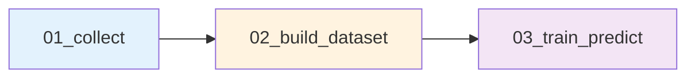

# 📄 Data Schema Definition (v3.0.0)

본 스키마는 SignalWeaver 프로젝트의 데이터 계약을 정의합니다.

---

## 📌 Schema Version & Metadata

| 속성 | 값 |
|------|-----|
| **Schema Version** | `3.0.0` |
| **Last Updated** | 2026-01-18 |
| **Breaking Changes** | Target 생성 위치 변경, Feature Shift 도입 |
| **Compatibility** | v2.x와 일부 호환 (마이그레이션 필요) |

---

## 📌 1. 파일 저장 규칙 / 포맷

### 1.1 기본 포맷

| 단계 | 포맷 | 이유 |
|------|------|------|
| **01단계 (Raw)** | CSV + 통합 Parquet | API 원본 보존 + 파이프라인 효율성 |
| **02단계 (Processed)** | Parquet + 선택적 CSV | 고속 I/O + 디버깅 지원 |
| **03단계 (Results)** | Parquet + 개별 CSV | 통합 분석 + 종목별 검증 |

### 1.2 파일 네이밍 규칙

```
# 01단계: 원시 데이터
data/01_raw/{YYYYMMDD}/
  ├── krx_prices_{YYYYMMDD}.parquet        # 통합 주가 데이터
  ├── ticker_master_{YYYYMMDD}.csv         # 종목 마스터 (Code-Name 매핑)
  └── csv/{종목명}.csv                      # 개별 CSV (옵션)

# 02단계: Feature 데이터셋
data/02_processed/{YYYYMMDD}/
  ├── dataset.parquet                       # 통합 Feature 데이터셋
  └── csv/{종목명}.csv                      # 개별 CSV (옵션)

# 03단계: 모델 산출물
data/03_results/{YYYYMMDD}/
  ├── predictions.parquet                   # 통합 예측 결과
  ├── csv/{종목명}.csv                      # 종목별 예측 (디버깅용)
  ├── feature_importance.csv                # Feature 중요도
  └── metrics_summary.csv                   # 성능 지표

# 04단계: 모델 저장소
data/04_models/{YYYYMMDD}/
  ├── {model_name}.pkl                      # 학습된 모델
  └── registry.json                         # 모델 메타데이터
```

---

## 📌 2. 공통 기본 컬럼

모든 단계에서 공통으로 사용되는 필수 컬럼입니다.

| 컬럼명 | 타입 | 설명 | 필수 여부 |
|--------|------|------|-----------|
| `date` | date | 거래일 (YYYY-MM-DD) | ✅ |
| `ticker` | string | 종목 코드 (6자리) | ✅ |
| `open` | float | 시가 | ✅ |
| `high` | float | 고가 | ✅ |
| `low` | float | 저가 | ✅ |
| `close` | float | 종가 | ✅ |
| `volume` | int64 | 거래량 | ✅ |
| `change_pct` | float | 등락률 (%, API 제공) | ⚠️ |

**⚠️ 주의사항**:
- `change_pct`는 FinanceDataReader API가 제공하는 값 (우리가 계산한 것 아님)
- **01단계**에서는 API가 주는 모든 컬럼을 보존
- **02단계** 이후에는 우리가 계산한 Feature만 추가

---

## 📌 3. Feature 스키마 (feature_ prefix)

### ⚠️ 명명 규칙
모든 Feature는 **`feature_` prefix**를 사용합니다.

### 3.1 가격 기반 기본 지표

| 컬럼명 | 설명 | 계산식 |
|--------|------|--------|
| `feature_ma_5` | 5일 단순 이동평균 | SMA(close, 5) |
| `feature_ma_20` | 20일 단순 이동평균 | SMA(close, 20) |
| `feature_ma_60` | 60일 단순 이동평균 | SMA(close, 60) |
| `feature_volatility_20` | 20일 수익률 표준편차 | STD(pct_change, 20) |

### 3.2 기술적 지표 (Technical Indicators)

| 컬럼명 | 설명 | 파라미터 |
|--------|------|----------|
| `feature_rsi_14` | RSI (Relative Strength Index) | period=14 |
| `feature_macd` | MACD 값 | short=12, long=26 |
| `feature_macd_signal` | MACD 시그널 | signal=9 |
| `feature_macd_hist` | MACD 히스토그램 | MACD - Signal |
| `feature_bb_upper` | 볼린저 상단 | MA20 + 2σ |
| `feature_bb_middle` | 볼린저 중심선 | MA20 |
| `feature_bb_lower` | 볼린저 하단 | MA20 - 2σ |

### 3.3 거래량 지표

| 컬럼명 | 설명 |
|--------|------|
| `feature_volume_ratio` | 거래량 비율 (현재/20일 평균) |

**계산 위치**: `src/features/builder.py` → `build_features()`

---

## 📌 4. Universe Meta (운영 판단용 지표)

02단계에서 생성되며, **학습 Feature 및 운영 필터링**에 활용됩니다.

| 컬럼명 | 타입 | 설명 | 용도 |
|--------|------|------|------|
| `liquidity_score` | float | 유동성 점수 (20일 평균 거래대금) | Feature / 필터 |
| `risk_composite` | float | 복합 리스크 점수 (0~1) | Feature / 필터 |
| `risk_volatility` | float | 변동성 리스크 성분 | Feature |
| `risk_volume_surge` | int | 거래량 급증 플래그 (0/1) | Feature |
| `is_suspended` | int | 거래정지 여부 (0: 정상, 1: 정지) | 필터 |
| `is_delisted` | int | 상장폐지 여부 (0: 정상, 1: 폐지) | 필터 |

**사용 시나리오**:
- **학습 시**: 리스크 플래그를 Feature로 포함 가능
- **운영 시**: `is_suspended=1` 종목 제외
- **Universe 선정**: `liquidity_score` 기준 필터링

**계산 위치**: `src/features/builder.py` → `build_universe_meta()`

---

## 📌 5. Target (타겟) 스키마

### ⚠️ 중요 변경 사항 (v3.0.0)

#### Target 생성 시점
- **v2.x**: 02단계에서 생성
- **v3.0.0**: **03단계에서 생성** ← 새로운 규칙

#### Target 정의
```python
# 03단계 (03_train_predict.ipynb)에서 생성
df['target_log_close'] = np.log(df['close'])

# Feature Shift: t일 행에 t-1일의 피처를 배치
# 의도: "어제 정보로 오늘 종가 예측"
for col in feature_cols:
    df[col] = df.groupby('ticker')[col].shift(1)
```

### 5.1 Target 컬럼

| 컬럼명 | 타입 | 설명 |
|--------|------|------|
| `target_log_close` | float | 로그 종가 (절대값 예측) |

**특징**:
- ✅ 절대값 예측 (수익률이 아님)
- ✅ 종목 간 가격 수준 차이 반영
- ✅ Shift된 Feature로 학습: t일 feature → t+1일 target

**생성 위치**: `03_train_predict.ipynb` (학습 직전)

---

## 📌 6. 모델 예측 결과 스키마

### 6.1 LightGBM 예측 결과

| 컬럼명 | 설명 |
|--------|------|
| `date` | 예측 기준일 |
| `ticker` | 종목 코드 |
| `y_true` | 실제 로그 종가 |
| `y_pred` | 예측 로그 종가 |
| `real_price` | 실제 종가 (원화) |
| `pred_price` | 예측 종가 (exp(y_pred)) |

**저장 위치**:
- 통합: `data/03_results/{ref_date}/predictions.parquet`
- 개별: `data/03_results/{ref_date}/csv/{종목명}.csv`

---

## 📌 7. 단계별 데이터 흐름

### 7.1 단계별 책임 분리



| 단계 | 입력 | 처리 | 출력 | Target |
|------|------|------|------|--------|
| **01** | - | API 수집 | Raw OHLCV | ❌ |
| **02** | Raw OHLCV | Feature 계산 | Feature + Meta | ❌ |
| **03** | Feature + Meta | Target 생성 + 학습 | 모델 + 예측 | ✅ |

### 7.2 데이터 변환 과정

```
[01단계]
ticker, date, open, high, low, close, volume
↓
[02단계]
+ feature_ma_5, feature_rsi_14, ...
+ liquidity_score, risk_composite, ...
- 초기 60일 제거 (warmup)
↓
[03단계]
+ target_log_close
+ Feature Shift (t → t-1)
↓
학습 데이터 완성
```

---

## 📌 8. 스키마 버전 관리 정책

### Semantic Versioning

```
schema_version: "MAJOR.MINOR.PATCH"

예: "3.0.0"
    │  │  └─ PATCH: 문서 업데이트, 주석 추가
    │  └──── MINOR: Feature 추가 (하위 호환)
    └─────── MAJOR: Target 생성 위치 변경 등 (하위 호환 X)
```

### 버전별 변경 이력

| Version | Date | Type | 주요 변경 사항 |
|---------|------|------|----------------|
| 3.0.0 | 2026-01-18 | 🔴 MAJOR | Target 생성 위치 변경 (02→03), Feature Shift 도입 |
| 2.0.0 | 2024-12-28 | 🔴 MAJOR | Feature prefix 통일, Universe Meta 추가 |
| 1.0.0 | 2024-12-01 | - | Initial release |

---

## 📌 9. 하위 호환성 & 마이그레이션

### v2.x → v3.0.0 마이그레이션

#### Breaking Change 1: Target 제거
**v2.x 데이터셋**에 `target_return` 등이 포함되어 있다면:

```python
# 02단계 출력에서 Target 컬럼 제거 (있다면)
df = pd.read_parquet("data/02_processed/{ref_date}/dataset.parquet")
target_cols = [c for c in df.columns if c.startswith('target_')]
if target_cols:
    df = df.drop(columns=target_cols)
    df.to_parquet("dataset_v3.parquet")
```

#### Breaking Change 2: Feature Shift 적용
**03단계**에서 학습 시 반드시 Shift 적용:

```python
# 필수: Feature Shift (t → t-1)
for col in feature_cols:
    df[col] = df.groupby('ticker')[col].shift(1)

# 필수: Shift로 발생한 NaN 제거
df = df.dropna(subset=feature_cols)
```

---

## ✔️ 주요 변경 사항 요약 (v3.0.0)

### 🔴 Breaking Changes

1. **Target 생성 위치 변경**
   - v2.x: 02단계에서 생성
   - v3.0.0: **03단계에서 생성**
   - 이유: 예측 목표가 실험마다 다를 수 있음

2. **Feature Shift 도입**
   - 의도: "어제 정보로 오늘 종가 예측"
   - 구현: `df[col] = df.groupby('ticker')[col].shift(1)`
   - 영향: 각 종목의 첫 행(NaN) 제거 필요

3. **Ticker를 Feature에서 제외**
   - v2.x: Categorical Feature로 사용 가능
   - v3.0.0: **Feature로 사용 안 함**
   - 이유: 신규 종목 예측 불가, 차원 폭발 방지
   - 대체: `liquidity_score`, `risk_composite` 등 Meta Features

### ✨ 개선 사항

1. **통합 모델 지향**
   - 단일 모델로 전체 종목 처리
   - 종목 간 공통 패턴 학습
   - 신규 상장 종목 즉시 예측 가능

2. **데이터 길이 표준화**
   - `filter_by_history()` 함수 도입
   - 종목별 데이터 길이 일치
   - Batch 학습 효율성 향상

---

## 📚 참고 문서

- **변경 이력**: `docs/changelog_schema.md`
- **Feature 계산**: `src/features/technical.py`
- **Universe 선정**: `src/universe/select_universe.py`
- **모델 인터페이스**: `src/models/base.py`

---

**Last Updated**: 2026-01-18  
**Schema Version**: 3.0.0  
**Maintained by**: SignalWeaver Team