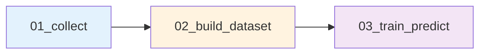

# 📄 Data Schema Definition (v3.1.1)

본 스키마는 SignalWeaver 프로젝트의 데이터 계약을 정의합니다.

---

## 📌 Schema Version & Metadata

| 속성 | 값 |
|------|-----|
| **Schema Version** | `3.1.1` |
| **Last Updated** | 2026-01-21 |
| **Breaking Changes** | Multi-horizon 예측 지원, Target 생성 위치 재변경 (03→02) |
| **Compatibility** | v3.0.x와 부분 호환 (타깃 컬럼명 변경) |

---

## 🔄 최근 변경 이력 요약

### v3.1.1 (2026-01-21) - PATCH
- **Target 생성 위치 재변경**: 03단계 → **02단계로 복귀**
- **이유**: 전처리와 학습 로직의 명확한 분리, 재현성 향상
- **영향**: 02단계 출력에 `target_log_close` 컬럼 포함됨

### v3.1.0 (2026-01-21) - MINOR
- **Multi-horizon 예측 지원**: 단일 시점 예측 → 5일치(Chunk) 예측
- **새로운 타깃 컬럼**: `target_log_close_h1` ~ `target_log_close_h5`
- **Trainer 로직 개선**: Target-Centric Alignment 방식 도입

---

## 📌 1. 파일 저장 규칙 / 포맷

### 1.1 기본 포맷

| 단계 | 포맷 | 이유 |
|------|------|------|
| **01단계 (Raw)** | CSV + 통합 Parquet | API 원본 보존 + 파이프라인 효율성 |
| **02단계 (Processed)** | Parquet + 선택적 CSV | 고속 I/O + 디버깅 지원 |
| **03단계 (Results)** | Parquet + 개별 CSV | 통합 분석 + 종목별 검증 |

### 1.2 파일 네이밍 규칙

```
# 01단계: 원시 데이터
data/01_raw/{YYYYMMDD}/
  ├── krx_prices_{YYYYMMDD}.parquet        # 통합 주가 데이터
  ├── ticker_master_{YYYYMMDD}.csv         # 종목 마스터 (Code-Name 매핑)
  └── csv/{종목명}.csv                      # 개별 CSV (옵션)

# 02단계: Feature 데이터셋
data/02_processed/{YYYYMMDD}/
  ├── dataset.parquet                       # 통합 Feature 데이터셋 (Target 포함)
  └── csv/{종목명}.csv                      # 개별 CSV (옵션)

# 03단계: 모델 산출물
data/03_results/{YYYYMMDD}/
  ├── predictions.parquet                   # 통합 예측 결과
  ├── csv/{종목명}.csv                      # 종목별 예측 (디버깅용)
  ├── feature_importance.csv                # Feature 중요도
  └── metrics_summary.csv                   # 성능 지표

# 04단계: 모델 저장소
data/04_models/{YYYYMMDD}/
  ├── {model_name}.pkl                      # 학습된 모델
  └── registry.json                         # 모델 메타데이터
```

---

## 📌 2. 공통 기본 컬럼

모든 단계에서 공통으로 사용되는 필수 컬럼입니다.

| 컬럼명 | 타입 | 설명 | 필수 여부 |
|--------|------|------|-----------|
| `date` | date | 거래일 (YYYY-MM-DD) | ✅ |
| `ticker` | string | 종목 코드 (6자리) | ✅ |
| `open` | float | 시가 | ✅ |
| `high` | float | 고가 | ✅ |
| `low` | float | 저가 | ✅ |
| `close` | float | 종가 | ✅ |
| `volume` | int64 | 거래량 | ✅ |
| `change_pct` | float | 등락률 (%, API 제공) | ⚠️ |

**⚠️ 주의사항**:
- `change_pct`는 FinanceDataReader API가 제공하는 값
- **01단계**에서는 API가 주는 모든 컬럼을 보존
- **02단계** 이후에는 우리가 계산한 Feature만 추가

---

## 📌 3. Feature 스키마 (feature_ prefix)

### ⚠️ 명명 규칙
모든 Feature는 **`feature_` prefix**를 사용합니다.

### 3.1 가격 기반 기본 지표

| 컬럼명 | 설명 | 계산식 |
|--------|------|--------|
| `feature_ma_5` | 5일 단순 이동평균 | SMA(close, 5) |
| `feature_ma_20` | 20일 단순 이동평균 | SMA(close, 20) |
| `feature_ma_60` | 60일 단순 이동평균 | SMA(close, 60) |
| `feature_volatility_20` | 20일 수익률 표준편차 | STD(pct_change, 20) |

### 3.2 기술적 지표 (Technical Indicators)

| 컬럼명 | 설명 | 파라미터 |
|--------|------|----------|
| `feature_rsi_14` | RSI (Relative Strength Index) | period=14 |
| `feature_macd` | MACD 값 | short=12, long=26 |
| `feature_macd_signal` | MACD 시그널 | signal=9 |
| `feature_macd_hist` | MACD 히스토그램 | MACD - Signal |
| `feature_bb_upper` | 볼린저 상단 | MA20 + 2σ |
| `feature_bb_middle` | 볼린저 중심선 | MA20 |
| `feature_bb_lower` | 볼린저 하단 | MA20 - 2σ |

### 3.3 거래량 지표

| 컬럼명 | 설명 |
|--------|------|
| `feature_volume_ratio` | 거래량 비율 (현재/20일 평균) |

**계산 위치**: `src/features/builder.py` → `build_features()`

---

## 📌 4. Universe Meta (운영 판단용 지표)

02단계에서 생성되며, **학습 Feature 및 운영 필터링**에 활용됩니다.

| 컬럼명 | 타입 | 설명 | 용도 |
|--------|------|------|------|
| `liquidity_score` | float | 유동성 점수 (20일 평균 거래대금) | Feature / 필터 |
| `risk_composite` | float | 복합 리스크 점수 (0~1) | Feature / 필터 |
| `risk_volatility` | float | 변동성 리스크 성분 | Feature |
| `risk_volume_surge` | int | 거래량 급증 플래그 (0/1) | Feature |
| `is_suspended` | int | 거래정지 여부 (0: 정상, 1: 정지) | 필터 |
| `is_delisted` | int | 상장폐지 여부 (0: 정상, 1: 폐지) | 필터 |

**사용 시나리오**:
- **학습 시**: 리스크 플래그를 Feature로 포함 가능
- **운영 시**: `is_suspended=1` 종목 제외
- **Universe 선정**: `liquidity_score` 기준 필터링

**계산 위치**: `src/features/builder.py` → `build_universe_meta()`

---

## 📌 5. Target (타겟) 스키마

### ⚠️ 중요 변경 사항 (v3.1.1)

#### Target 생성 시점의 변천사
- **v2.x**: 02단계에서 생성
- **v3.0.0**: 03단계에서 생성 (실험 유연성 목적)
- **v3.1.1**: **02단계로 복귀** ← **현재 규칙**

#### 복귀 이유
1. **재현성 보장**: 데이터셋 자체가 학습 준비 완료 상태
2. **책임 분리**: 전처리(02) vs 학습(03) 명확히 구분
3. **파이프라인 안정성**: 03단계는 순수하게 모델 학습만 담당

### 5.1 Target 정의

```python
# 02단계 (02_build_dataset.ipynb)에서 생성
df['target_log_close'] = np.log(df['close'])
```

### 5.2 Target 컬럼

| 컬럼명 | 타입 | 설명 | 생성 위치 |
|--------|------|------|-----------|
| `target_log_close` | float | 로그 종가 (기준 타깃) | **02단계** |

**특징**:
- ✅ 절대값 예측 (수익률이 아님)
- ✅ 종목 간 가격 수준 차이 반영
- ✅ Multi-horizon 학습의 공통 기준점

**생성 위치**: `02_build_dataset.ipynb` (전처리 단계)

---

## 📌 6. Multi-Horizon 예측 구조 (v3.1.0+)

### 6.1 개념

기존의 단일 시점 예측 대신, **한 번의 학습으로 5일치(1주일) 가격을 동시에 예측**합니다.

```
입력 (t-5일 피처) → 모델 → 출력 (t일 가격 예측)
입력 (t-4일 피처) → 모델 → 출력 (t일 가격 예측)
입력 (t-3일 피처) → 모델 → 출력 (t일 가격 예측)
입력 (t-2일 피처) → 모델 → 출력 (t일 가격 예측)
입력 (t-1일 피처) → 모델 → 출력 (t일 가격 예측)
```

### 6.2 Horizon 정의

| Horizon | 의미 | 학습 시 Feature 시점 | 예측 대상 |
|---------|------|---------------------|-----------|
| h=1 | 1일 앞 예측 | t-1일 | t일 종가 |
| h=2 | 2일 앞 예측 | t-2일 | t일 종가 |
| h=3 | 3일 앞 예측 | t-3일 | t일 종가 |
| h=4 | 4일 앞 예측 | t-4일 | t일 종가 |
| h=5 | 5일 앞 예측 | t-5일 | t일 종가 |

### 6.3 Target-Centric Alignment

**핵심 원리**: 예측 결과의 `date` 컬럼이 **실제 예측 대상일**과 일치하도록 데이터를 정렬합니다.

```python
# Trainer 내부 로직 (src/modeling/trainer.py)
for h in horizons:
    # 1. Feature를 과거로 시프트 (h일 전 데이터 사용)
    for col in feature_cols:
        temp_df[col] = temp_df.groupby('ticker')[col].shift(h)
    
    # 2. Target은 시프트하지 않음 (오늘의 정답)
    # 3. 날짜 슬라이싱으로 학습/검증 구간 분리
```

**결과**: 예측 데이터프레임의 `date`가 "언제의 가격을 맞추려 했는가"를 명확히 표현

---

## 📌 7. 모델 예측 결과 스키마

### 7.1 Multi-Horizon 예측 출력

| 컬럼명 | 설명 |
|--------|------|
| `date` | 예측 대상 날짜 (타깃 시점) |
| `ticker` | 종목 코드 |
| `close` | 실제 종가 (원화) |
| `target_log_close` | 실제 로그 종가 (공통 정답) |
| `pred_target_log_close_h1` | h=1 예측값 (로그) |
| `pred_target_log_close_h2` | h=2 예측값 (로그) |
| ... | ... |
| `pred_target_log_close_h5` | h=5 예측값 (로그) |
| `true_target_log_close_h1` | h=1 정답값 (참조용) |
| ... | ... |

**특징**:
- 각 행의 `date`는 예측 대상 시점
- 동일한 날짜에 대해 5가지 시차의 예측값이 존재
- 로그 가격 예측값은 `np.exp()`로 실제 가격 변환 가능

**저장 위치**:
- 통합: `data/03_results/{ref_date}/predictions.parquet`
- 개별: `data/03_results/{ref_date}/csv/{종목명}.csv`

---

## 📌 8. 단계별 데이터 흐름

### 8.1 단계별 책임 분리 (Updated)



| 단계 | 입력 | 처리 | 출력 | Target 생성 |
|------|------|------|------|-------------|
| **01** | - | API 수집 | Raw OHLCV | ❌ |
| **02** | Raw OHLCV | Feature 계산 + **Target 생성** | Feature + Meta + Target | ✅ |
| **03** | Feature + Target | **Multi-horizon 학습** + 예측 | 모델 + 예측 | ❌ (사용만) |

### 8.2 데이터 변환 과정 (Updated)

```
[01단계]
ticker, date, open, high, low, close, volume
↓
[02단계]
+ feature_ma_5, feature_rsi_14, ...
+ liquidity_score, risk_composite, ...
+ target_log_close (새로 추가됨)
- 초기 60일 제거 (warmup)
↓
[03단계]
각 Horizon별로:
  - Feature를 h일 과거로 Shift
  - Target은 고정 (오늘의 정답)
  - Shift-then-Slice 방식으로 경계면 데이터 손실 방지
↓
Multi-horizon 학습 데이터 완성
```

---

## 📌 9. 스키마 버전 관리 정책

### Semantic Versioning

```
schema_version: "MAJOR.MINOR.PATCH"

예: "3.1.1"
    │  │  └─ PATCH: Target 생성 위치 재변경 (03→02)
    │  └──── MINOR: Multi-horizon 예측 지원
    └─────── MAJOR: 근본적 데이터 구조 변경 (v2→v3: Feature prefix 등)
```

### 버전별 변경 이력

| Version | Date | Type | 주요 변경 사항 |
|---------|------|------|----------------|
| **3.1.1** | 2026-01-21 | 🔵 PATCH | Target 생성 위치 재변경 (03→02), 재현성 향상 |
| **3.1.0** | 2026-01-21 | 🟢 MINOR | Multi-horizon 예측 지원, Target-Centric Alignment |
| 3.0.0 | 2026-01-18 | 🔴 MAJOR | Target 생성 위치 변경 (02→03), Feature Shift 도입 |
| 2.0.0 | 2024-12-28 | 🔴 MAJOR | Feature prefix 통일, Universe Meta 추가 |
| 1.0.0 | 2024-12-01 | - | Initial release |

---

## 📌 10. 마이그레이션 가이드

### v3.0.x → v3.1.1

#### 변경 사항 1: Target 위치 복귀
**v3.0.x**: 03단계에서 Target 생성  
**v3.1.1**: **02단계에서 Target 생성**

**마이그레이션 필요 없음**: 02단계를 다시 실행하면 자동으로 `target_log_close` 포함

#### 변경 사항 2: Multi-Horizon 지원
**영향**: 03단계 학습 코드 업데이트 필요

**Before (v3.0.x)**:
```python
# 단일 시점 예측
model.fit(X_train, y_train['target_log_close'])
predictions = model.predict(X_test)
```

**After (v3.1.1)**:
```python
# Multi-horizon 예측
model.fit(X_train, y_train[['target_log_close']])
predictions = model.predict(X_test)  # DataFrame with h1~h5 columns
```

---

## ✔️ 주요 변경 사항 요약 (v3.1.1)

### 🔵 PATCH Changes

1. **Target 생성 위치 복귀** (03 → 02)
   - **이유**: 재현성 보장, 책임 분리 명확화
   - **영향**: 02단계 출력에 `target_log_close` 포함
   - **하위 호환**: v3.0.x 사용자는 02단계 재실행 권장

### 🟢 MINOR Changes (v3.1.0)

1. **Multi-Horizon 예측 구조**
   - 5일치(h1~h5) 동시 예측 지원
   - Target-Centric Alignment 방식
   - 예측 결과의 `date`가 실제 예측 대상일과 일치

2. **Shift-then-Slice 패턴**
   - 전체 데이터를 먼저 시프트한 후 슬라이싱
   - 경계면 데이터 손실 방지
   - 학습 효율성 향상

### ✨ 개선 사항

1. **파이프라인 안정성**
   - 02단계: 전처리 + Target 생성 (완결성)
   - 03단계: 순수 학습 로직 (단순성)

2. **재현성 강화**
   - 02단계 출력만으로 학습 재현 가능
   - 실험 간 데이터셋 일관성 보장

---

## 📚 참고 문서

- **변경 이력**: `docs/changelog_schema.md` (업데이트 필요)
- **Feature 계산**: `src/features/technical.py`
- **Universe 선정**: `src/universe/select_universe.py`
- **모델 인터페이스**: `src/models/base.py`
- **Multi-Horizon Trainer**: `src/modeling/trainer.py`

---

**Last Updated**: 2026-01-21  
**Schema Version**: 3.1.1  
**Maintained by**: SignalWeaver Team