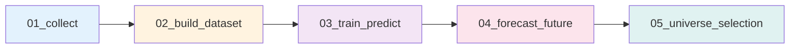

# 📄 Data Schema Definition (v3.2.0)

본 스키마는 SignalWeaver 프로젝트의 데이터 계약을 정의합니다.

---

## 📌 Schema Version & Metadata

| 속성 | 값 |
|------|-----|
| **Schema Version** | `3.2.0` |
| **Last Updated** | 2026-02-07 |
| **Latest Changes** | 04단계(미래 예측) + 05단계(유니버스 선정) 추가 |
| **Compatibility** | v3.1.1 하위 호환 (기존 02~03단계 구조 유지) |

---

## 🔄 최근 변경 이력 요약

### v3.2.0 (2026-02-07) - 🟢 MINOR
- **04단계 추가**: Recursive Extension을 이용한 미래 주가 예측
- **05단계 추가**: 3대 평가 지표(정확도/수익성/리스크) 기반 유니버스 선정
- **새로운 데이터 구조**: 예측 결과, 위험 지표, 종합 점수 등

### v3.1.1 (2026-01-21) - 🔵 PATCH
- **Target 생성 위치 재변경**: 03단계 → 02단계로 복귀
- **이유**: 전처리와 학습 로직의 명확한 분리, 재현성 향상
- **영향**: 02단계 출력에 `target_log_close` 컬럼 포함됨

### v3.1.0 (2026-01-21) - 🟢 MINOR
- **Multi-horizon 예측 지원**: 단일 시점 예측 → 5일치(Chunk) 예측
- **새로운 타깃 컬럼**: `target_log_close_h1` ~ `target_log_close_h5`
- **Trainer 로직 개선**: Target-Centric Alignment 방식 도입

---

## 📌 파일 저장 규칙 / 포맷 (Updated v3.2.0)

### 1.1 기본 포맷

| 단계 | 포맷 | 이유 |
|------|------|------|
| **01단계 (Raw)** | CSV + 통합 Parquet | API 원본 보존 + 파이프라인 효율성 |
| **02단계 (Processed)** | Parquet + 선택적 CSV | 고속 I/O + 디버깅 지원 |
| **03단계 (Results)** | Parquet + 개별 CSV | 통합 분석 + 종목별 검증 |
| **04단계 (Forecasts)** | 🆕 Parquet + 선택적 CSV | 미래 예측값 저장 |
| **05단계 (Universe)** | 🆕 Parquet + CSV + JSON | 투자 후보 선정 결과 |

### 1.2 파일 네이밍 규칙 (v3.2.0)

```
# 04단계: 미래 예측 (Recursive Extension)
data/03_results/{YYYYMMDD}/forecasts/
  ├── future_forecasts.parquet         # 통합 미래 예측값
  └── csv/{종목명}_forecast.csv        # 개별 CSV (옵션)

# 05단계: 유니버스 선정 (새로 추가)
data/03_results/{YYYYMMDD}/universe/
  ├── universe_full.parquet            # 전체 평가 완료 종목 (모든 지표)
  ├── universe_candidates.parquet      # Top-K 후보 (Parquet)
  ├── investment_report.csv            # 상세 리포트 (사람 가독성)
  ├── investment_report.xlsx           # Excel 리포트 (선택, 시트 다중)
  └── filter_statistics.json           # 필터링 통계 (메타)
```

---

## 📌 2. 공통 기본 컬럼

모든 단계에서 공통으로 사용되는 필수 컬럼입니다.

| 컬럼명 | 타입 | 설명 | 필수 여부 |
|--------|------|------|-----------|
| `date` | date | 거래일 (YYYY-MM-DD) | ✅ |
| `ticker` | string | 종목 코드 (6자리) | ✅ |
| `open` | float | 시가 | ✅ |
| `high` | float | 고가 | ✅ |
| `low` | float | 저가 | ✅ |
| `close` | float | 종가 | ✅ |
| `volume` | int64 | 거래량 | ✅ |

---

## 📌 3. Feature 스키마 (feature_ prefix)

### 3.1 가격 기반 기본 지표

| 컬럼명 | 설명 |
|--------|------|
| `feature_ma_5` | 5일 단순 이동평균 |
| `feature_ma_20` | 20일 단순 이동평균 |
| `feature_ma_60` | 60일 단순 이동평균 |
| `feature_volatility_20` | 20일 수익률 표준편차 |

### 3.2 기술적 지표 (Technical Indicators)

| 컬럼명 | 설명 |
|--------|------|
| `feature_rsi_14` | RSI (Relative Strength Index) |
| `feature_macd` | MACD 값 |
| `feature_macd_signal` | MACD 시그널 |
| `feature_macd_hist` | MACD 히스토그램 |
| `feature_bb_upper` | 볼린저 상단 |
| `feature_bb_middle` | 볼린저 중심선 |
| `feature_bb_lower` | 볼린저 하단 |
| `feature_volume_ratio` | 거래량 비율 |

---

## 📌 4. Universe Meta (운영 판단용 지표)

02단계에서 생성되며, **학습 Feature 및 운영 필터링**에 활용됩니다.

| 컬럼명 | 타입 | 설명 |
|--------|------|------|
| `liquidity_score` | float | 유동성 점수 (20일 평균 거래대금) |
| `risk_composite` | float | 복합 리스크 점수 (0~1) |
| `is_suspended` | int | 거래정지 여부 (0: 정상, 1: 정지) |
| `is_delisted` | int | 상장폐지 여부 (0: 정상, 1: 폐지) |

---

## 📌 5. Target (타겟) 스키마

### 5.1 Target 정의 (v3.1.1 규칙 유지)

```python
# 02단계에서 생성
df['target_log_close'] = np.log(df['close'])
```

### 5.2 Target 컬럼

| 컬럼명 | 타입 | 설명 | 생성 위치 |
|--------|------|------|-----------|
| `target_log_close` | float | 로그 종가 (기준 타깃) | **02단계** |

---

## 📌 6. Multi-Horizon 예측 구조 (v3.1.0 규칙 유지)

### 6.1 개념

기존의 단일 시점 예측 대신, **한 번의 학습으로 5일치(1주일) 가격을 동시에 예측**합니다.

```
입력 (t-5일 피처) → 모델 → 출력 (t일 가격 예측)
입력 (t-4일 피처) → 모델 → 출력 (t일 가격 예측)
...
입력 (t-1일 피처) → 모델 → 출력 (t일 가격 예측)
```

### 6.2 Horizon 정의

| Horizon | 의미 | 학습 시 Feature 시점 |
|---------|------|---------------------|
| h=1 | 1일 앞 예측 | t-1일 |
| h=2 | 2일 앞 예측 | t-2일 |
| h=3 | 3일 앞 예측 | t-3일 |
| h=4 | 4일 앞 예측 | t-4일 |
| h=5 | 5일 앞 예측 | t-5일 |

---

## 📌 7. 모델 예측 결과 스키마 (03단계)

### 7.1 Multi-Horizon 예측 출력

| 컬럼명 | 설명 |
|--------|------|
| `date` | 예측 대상 날짜 (타깃 시점) |
| `ticker` | 종목 코드 |
| `close` | 실제 종가 (원화) |
| `target_log_close` | 실제 로그 종가 (공통 정답) |
| `pred_target_log_close_h1` | h=1 예측값 (로그) |
| `pred_target_log_close_h2` | h=2 예측값 (로그) |
| ... | ... |
| `pred_target_log_close_h5` | h=5 예측값 (로그) |
| `true_target_log_close_h1` | h=1 정답값 (참조용) |

**저장 위치**:
- 통합: `data/03_results/{ref_date}/predictions.parquet`
- 개별: `data/03_results/{ref_date}/csv/{종목명}.csv`

---

## 📌 8. 미래 예측 결과 스키마 (🆕 04단계)

### 8.1 Recursive Extension 출력

**개념**: 최신 데이터로부터 5일치 Chunk를 반복 예측하여 장기 미래를 확장

| 컬럼명 | 타입 | 설명 |
|--------|------|------|
| `date` | date | 예측 대상 날짜 |
| `ticker` | string | 종목 코드 |
| `horizon` | int | 예측 시차 (1~5) |
| `chunk_idx` | int | Recursive 단계 (0, 1, 2, ...) |
| `pred_log_close` | float | 예측 로그 종가 |
| `pred_close` | float | 예측 종가 (원화) |

### 8.2 Chunk 기반 구조

```
Chunk 0: 예측 0~4일 (t-1 ~ t-5 Feature 사용)
Chunk 1: 예측 5~9일 (Chunk 0 예측값을 Feature처럼 사용)
Chunk 2: 예측 10~14일 (Chunk 1 예측값 기반)
...
```

**저장 위치**:
- 통합: `data/03_results/{ref_date}/forecasts/future_forecasts.parquet`
- 개별: `data/03_results/{ref_date}/forecasts/csv/{종목명}_forecast.csv` (선택)

### 8.3 Recursive Extension의 오차 누적

⚠️ **주의**: 뒤로 갈수록 오차 증가
- Chunk 0: 낮은 오차 (실제 Feature 기반)
- Chunk 1: 중간 오차 (Chunk 0 예측값 기반)
- Chunk 2+: 높은 오차 (예측값 체인)

**권장사항**:
- 거래: Chunk 0~1만 신뢰 (최대 10일)
- 분석: Chunk 2+ 참고용 (확률 낮음)

---

## 📌 9. 유니버스 선정 결과 스키마 (🆕 05단계)

### 9.1 평가 지표 (3대 축)

#### A. 정확도 (Accuracy)

| 컬럼명 | 설명 |
|--------|------|
| `rmse` | 과거 예측의 오차(RMSE) |
| `mae` | 평균 절대 오차 |
| `directional_accuracy` | 상승/하락 방향 적중률 (0~1) |
| `confidence_rmse` | RMSE 역수 기반 신뢰도 (높을수록 정확) |
| `accuracy_rank` | 정확도 순위 (낮을수록 정확) |

#### B. 수익성 (Return)

| 컬럼명 | 설명 |
|--------|------|
| `daily_log_return` | 시간당 로그 수익률 (복리 기반) |
| `total_log_return` | 총 로그 수익률 |
| `total_return_pct` | 총 수익률 (%) |
| `hold_days` | 최적 보유 기간 (일) |
| `buy_date` | 최적 매수일 |
| `sell_date` | 최적 매도일 |
| `buy_price` | 예상 매수가 |
| `sell_price` | 예상 매도가 |
| `return_rank` | 수익률 순위 (낮을수록 높은 수익 기대) |

#### C. 위험도 (Risk, 🆕 추가)

| 컬럼명 | 설명 |
|--------|------|
| `volatility` | 변동성 (로그 수익률 표준편차) |
| `downside_risk` | 하방 위험 (음수 수익률만) |
| `var_95` | VaR (5% 분위수) |
| `cvar_95` | CVaR (최악 5% 평균) |
| `max_drawdown` | 최대 낙폭 |
| `skewness` | 비대칭도 (음수면 하락 쏠림) |
| `kurtosis` | 초과 첨도 (Fat Tail 지표) |
| `risk_composite_raw` | 복합 리스크 점수 (원점수) |
| `risk_score_normalized` | 정규화 리스크 점수 (0~1) |
| `risk_rank` | 위험 순위 (낮을수록 안전) |

### 9.2 메타 정보

| 컬럼명 | 설명 |
|--------|------|
| `ticker` | 종목 코드 |
| `liquidity_score` | 유동성 점수 |
| `is_suspended` | 거래정지 여부 |
| `is_delisted` | 상장폐지 여부 |

### 9.3 최종 평가 점수 (2가지 전략)

#### Strategy A: 가중 선형 결합 (균형)

```python
final_score = 0.40 × accuracy_score + 0.35 × return_score + 0.25 × safety_score
```

**특징**:
- 각 지표가 균형있게 기여
- 안정적이고 해석 용이
- 보수적 운용에 적합

#### Strategy B: 신뢰도 가중 (확실성) ⭐

```python
final_score = expected_return × (confidence^1.5)
```

**특징**:
- "확실한 수익"에 집중 (Kelly Criterion)
- 정확도 낮은 종목 자동 배제
- 공격적 운용에 적합

**저장 위치**:
```
universe_full.parquet:
  ├── 개별 전략 점수 (score_strategy_a, score_strategy_b)
  └── 모든 평가 지표 포함

universe_candidates.parquet:
  ├── return_rank 기준 상위 K개 (기본 전략)
  ├── 모든 평가 지표 포함
  └── 최종 선정된 투자 후보
```

### 9.4 필터링 단계

#### Hard Constraints (필수 조건)

| 필터 | 제거 대상 | 기준 |
|------|-----------|------|
| 거래정지/상폐 | `is_suspended=1`, `is_delisted=1` | 매매 불가능 |
| 저유동성 | 평균 거래대금 < 5천만 원 | 체결 불가 위험 |
| 고위험 | `risk_composite_raw` > 0.8 | 손실 위험 높음 |
| 저정확도 | `accuracy_rank` > 1000 | 예측 신뢰도 낮음 |

#### Soft Ranking (점수 기반)

- Strategy A 또는 B로 점수화
- 상위 Top-K 선정

---

## 📌 10. 단계별 데이터 흐름 (v3.2.0)

### 10.1 전체 파이프라인 (Updated)



### 10.2 단계별 책임 분리 (Updated)

| 단계 | 입력 | 처리 | 출력 | Target 생성 |
|------|------|------|------|-------------|
| **01** | - | API 수집 | Raw OHLCV | ❌ |
| **02** | Raw OHLCV | Feature 계산 + **Target 생성** | Feature + Meta + Target | ✅ |
| **03** | Feature + Target | Multi-horizon 학습 + 예측 | 모델 + 예측 | ❌ |
| **🆕 04** | 모델 + Feature | Recursive Extension | 미래 5~60일 예측 | ❌ |
| **🆕 05** | 예측값 + 메타 | 평가 + 필터링 + 점수화 | 투자 후보 + 지표 | ❌ |

### 10.3 데이터 변환 과정 (Updated)

```
[01단계]
ticker, date, open, high, low, close, volume

[02단계]
+ feature_ma_5, feature_rsi_14, ...
+ liquidity_score, risk_composite, ...
+ target_log_close

[03단계]
각 Horizon별로:
  - Feature를 h일 과거로 Shift
  - Multi-horizon 학습
  
결과: pred_target_log_close_h1~h5

[04단계] 🆕
Recursive Extension 반복:
  - Chunk 0: t-1~t-5 Feature → t+0~t+4 예측
  - Chunk 1: Chunk0 + Feature → t+5~t+9 예측
  - ...
  
결과: future_forecasts (t+1 ~ t+60)

[05단계] 🆕
3대 평가 지표 계산:
  - 정확도: 과거 예측 오차 (model_train_date 기준)
  - 수익성: 예측 수익률 (forecast_date 기준)
  - 위험: 예측값 변동성 (내재 리스크)
  
결과: universe_full + candidates
```

---

## 📌 11. 핵심 개념: 이중 날짜 기준 (🆕 05단계)

### 11.1 정확도 평가 날짜

```
model_train_date: 2026-01-20 (학습 기준일)
  ↓
  [정확도 평가]
  - 이전 예측값: 실제값과 비교 가능 (과거 데이터)
  - 지표: RMSE, MAE, 방향성 정확도
```

### 11.2 수익성 평가 날짜

```
forecast_date: 2026-02-07 (투자 결정 시점)
  ↓
  [수익성 평가]
  - 미래 예측값: 정답 없음 (예측값만 존재)
  - 지표: 예상 수익률, 최적 매매 시점
```

**중요**: 두 날짜는 다르며, 각각 다른 데이터 세트 사용

---

## 📌 12. 스키마 버전 관리 정책

### Semantic Versioning

```
schema_version: "MAJOR.MINOR.PATCH"

예: "3.2.0"
    │  │  └─ PATCH: 문서/설명 개선, 유틸 함수 추가
    │  └──── MINOR: 새 단계 추가, 새 지표 추가 ← v3.2.0
    └─────── MAJOR: 근본 구조 변경 (v2→v3)
```

### 버전별 변경 이력

| Version | Date | Type | 주요 변경 사항 |
|---------|------|------|----------------|
| **3.2.0** | 2026-02-07 | 🟢 MINOR | 04단계(미래 예측) + 05단계(유니버스) 추가 |
| **3.1.1** | 2026-01-21 | 🔵 PATCH | Target 생성 위치 재변경 (03→02) |
| **3.1.0** | 2026-01-21 | 🟢 MINOR | Multi-horizon 예측, Target-Centric Alignment |
| 3.0.0 | 2026-01-18 | 🔴 MAJOR | Target 위치 변경, Feature Shift, Ticker 제외 |
| 2.0.0 | 2024-12-28 | 🔴 MAJOR | Feature prefix 통일, Universe Meta 추가 |
| 1.0.0 | 2024-12-01 | - | Initial release |

---

## 📌 13. 마이그레이션 가이드

### v3.1.1 → v3.2.0 (MINOR, 상위 호환)

**추가 단계**:
1. 04단계 실행: `04_forecast_future.ipynb`
2. 05단계 실행: `05_universe_selection.ipynb`

**기존 코드 변경 불필요**: v3.1.1 구조 완전 유지

---

## ✔️ 주요 변경 사항 요약 (v3.2.0)

### 🟢 MINOR Changes

#### 1. 04단계 추가: 미래 주가 예측

**핵심 특징**:
- Recursive Extension (Chunk 단위 반복 예측)
- 최신 데이터 → 5~60일 미래 예측
- 데이터: `future_forecasts.parquet`

**컬럼**: date, ticker, horizon, chunk_idx, pred_log_close, pred_close

**저장 위치**: `data/03_results/{ref_date}/forecasts/`

#### 2. 05단계 추가: 유니버스 선정

**핵심 특징**:
- 3대 평가 지표: 정확도 (과거) + 수익성 (미래) + 위험도
- Hard Constraints + Soft Ranking 2단계 필터링
- 2가지 전략 제공: 균형형(A) / 확실성형(B)

**산출물**:
- `universe_full.parquet`: 모든 평가 완료 종목
- `universe_candidates.parquet`: Top-K 투자 후보
- `investment_report.csv`: 사람 가독성 리포트
- `investment_report.xlsx`: Excel 멀티시트

#### 3. 위험도 지표 추가

**새로운 지표**:
- `volatility`, `downside_risk`, `var_95`, `cvar_95`
- `max_drawdown`, `skewness`, `kurtosis`
- `risk_composite_raw`, `risk_score_normalized`

**용도**: 종목 내재 위험 평가 (모델 예측 오차와 독립)

### ✨ 개선 사항

1. **파이프라인 확장**: 01~03 → 01~05 (2단계 추가)
2. **평가 다각화**: 정확도+수익성+리스크 3축 평가
3. **필터링 강화**: Hard+Soft 2단계, Phase 2 설계서 반영
4. **사용성 개선**: 다양한 포맷 출력 (Parquet/CSV/Excel/JSON)

---

## 📚 참고 문서

- **변경 이력**: `docs/changelog_schema.md` (2026-02-07 추가 예정)
- **미래 예측**: `04_forecast_future.ipynb`
- **유니버스 선정**: `05_universe_selection.ipynb`
- **위험 평가**: `src/utils/risk.py`
- **하드 필터**: `src/utils/filters.py`

---

**Last Updated**: 2026-02-07  
**Schema Version**: 3.2.0  
**Status**: ✅ Stable  
**Maintained by**: SignalWeaver Team